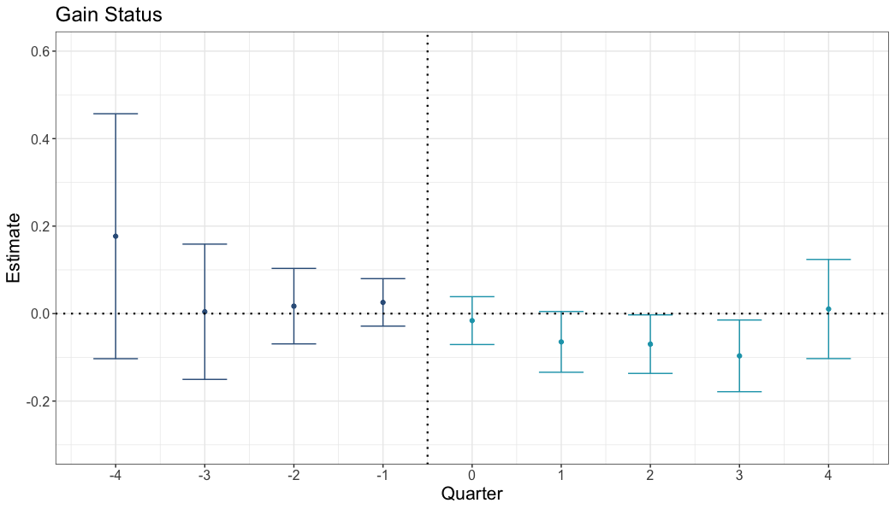
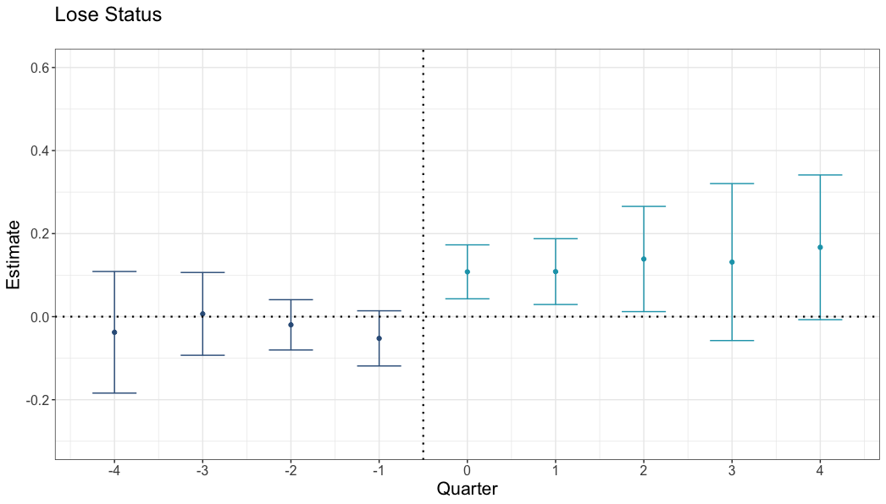

## Background & Context

-   Platforms present signals of quality to customers. 
  -   Consumer-generated ratings (e.g., star ratings).
  -   Superhost status on Airbnb.
-   There are very basic unanswered questions about these ratings:
  -   What do star ratings **actually measure**?
    -   Objective quality?
    -   Value for price?
    -   **Performance vs expectations?**
  -   How do star ratings **interact with other signals of quality**?

## Research Objective

**Does Airbnb's Superhost status influence listings' ratings?**

- Superhost status exists to make listings appealing.
- Consumers' post-experience ratings may depend on prior expectations. 
  - A star rating depends on what you compare your experience to.

Therefore, we explore whether gaining Superhost status decreases star ratings (and losing status increases ratings)---a downside to a well-meaning signal.

## Data

-   1.5M+ individual Airbnb ratings and reviews
    -   Scraped from Airbnb.com using Python
    -   Includes ratings, text review, author ID, date
-   Quarterly observations of listing information
    -   Collected from [InsideAirbnb](InsideAirbnb.com)
    -   Includes Superhost status, price, amenities, etc.
-   500k+ Vrbo.com ratings, reviews, and listing observations
    -   Scraped from [Vrbo.com](Vrbo.com) using Python
    -   Includes listing titles, host names, amenities, ratings, text review, author ID, date

## Method

- Staggered difference-in-differences regression analysis of Airbnb listings that **change** status to **themselves on Vrbo over time** (when they are vs are not Superhosts).

Comparing ratings across platforms provides **strong causal inference**:

- Avoids confounding status with differences in quality between listings
- "Staggered" means that Superhost status changes at different times for different listings. Change is not confounded with market trends.
- Comparing ratings on Airbnb to Vrbo for the same listings controls for potential changes in listings over time 
  - e.g., If hosts drop amenities once they reach Superhost status, or become burned out.

## Main Difficulty

No unique ID between Airbnb and Vrbo for properties that are cross-listed. 

- First attempted Random Forest and XGBoost methods.
- Cost of having humans manually code a test set was prohibitive.
- **Solution**: Simple matching algorithm.
  - Nearby latitude/longitude.
  - ±2 guests accommodated (platforms count beds differently).
  - Listing name and host name partial and full matches.
  
## Result

Estimated difference in each quarter in ratings between Airbnb and Vrbo, **compared to the difference when status changed**^[We compare the differences to the difference when status changes because we do not expect ratings to be equal before the change in status across platforms.]

If Superhost status did not affect ratings, we would see the light blue dots (right side) to be at zero. Instead, when listings **gain** status, their ratings are **lower** on Airbnb than on Vrbo:

<strong>Differences in ratings: Airbnb listings that gain Superhost status (vs same properties on Vrbo)</strong>

## Result {.unnumbered .unlisted}

When listings **lose** status, their ratings are **higher** on Airbnb than on Vrbo:

<strong>Differences in ratings: Airbnb listings that lose Superhost status (vs same properties on Vrbo)</strong>

## Result {.unnumbered .unlisted}

What if **different people** stay at Superhosts? 

- If those who stay at Superhosts are grumpier/more discerning, they should give lower ratings. 
  - **This would create the pattern of results we see**.
- We analyze the effect of Superhost status on Airbnb ratings after removing differences between reviewers. 
  - We found the same result:
  - After removing differences between reviewers, listings receive lower ratings during the time when they are Superhosts than when they are not.

## Follow-Up Experiments

<small>[Details at mattmeister.com](https://mattmeister.com/posts/star_ratings_steves.html)</small>

-   500 participants chose between pairs of listings:
    -   Superhost + lower rating
    -   Non-Superhost + higher rating
-   Repeated four times for each participant

Higher ratings led to a 52% increase in choice:

-   55% preferred the higher-rated Non-Superhost
-   36% preferred the lower-rated Superhost
-   9% had no preference

## Takeaways

**1. Superhost → Rating Drop**

**2. Customers Don't Adjust When Choosing**

## Takeaways {.unnumbered .unlisted}

**1. Superhost → Rating Drop**

-   Statistically significant decline **after gaining** Superhost status
-   Larger statistically significant increase **after losing** Superhost status

Superhost status influences expectations without changing quality.

The same experience feels worse from a Superhost.

## Takeaways {.unnumbered .unlisted}

**2. Customers Don't Adjust When Choosing**

-   55% chose non-superhost listings that had higher ratings

Why? 

- Customers are used to using ratings to compare options. 
- They can discern between a 4.80- and 4.65-star property. 
- They cannot map Superhost status onto a rating
  - Customers do not know how to handle different status and different ratings simultaneously.

## Implications

-   Information exists in relation to other information.
-   Something that increases expectations (and choice) may negatively impact ratings (and choice).
-   Be conscious of the tradeoff for choice.
  - Superhost status increases choice on aggregate.
    - Customers can filter by it. 
  - But Superhost status is not as effective as it could be, as is.

## Links & Resources

-   Full Academic Paper: [Journal of Consumer Research (open access)](https://doi.org/10.1093/jcr/ucaf008)\
-   Blog Summary: [mattmeister.com](https://mattmeister.com/posts/star_ratings_steves.html)
-   All Code, Data, and Materials: [Open Science Framework](https://osf.io/3he6c/?%20view_only=42ce01d5ca714610a386a39c52360541)
