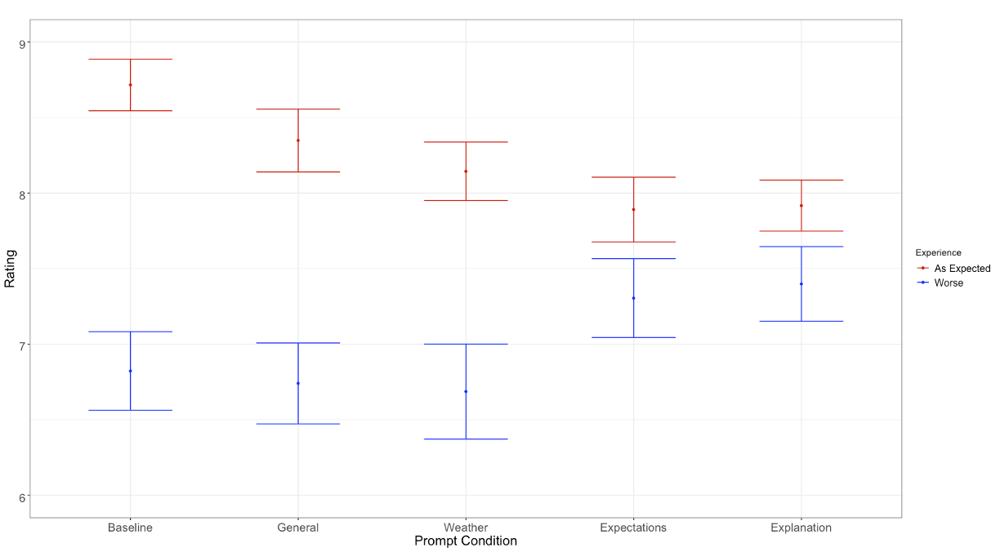

### Situation

Consumer-generated ratings and reviews are an incredibly popular way for people to compare products online. Ideally, reviews help consumers make better choices, by explaining the experiences of former consumers of a product. However, this **experiential nature** of reviews (and ratings---I will use the term interchangeably unless needed) **comes with a cost**:

**Not all aspects of one person's experience are relevant to another's.**

Therefore, much of the information contained in a review can mislead---rather than help---future consumers.

#### What do I mean?

To aide understanding, I will explain this point using one of the products our project focused on---**winter jackets**. 

We buy winter jackets for multiple reasons, but an important one is to stay warm in cold weather. Therefore, the experience of owning a winter jacket (i.e., what a review should be communicating) is affected by how warm one feels when wearing the jacket. 

However, a jacket is not the only thing that affects warmth. Obviously, the temperature outside affects warmth as well.

Therefore, it may be the case that reviewers are influenced by the temperature while they wear their jacket (in more abstract terms, temperature represents the *context* in which someone consumes the jacket). If so, their review is likely to be less useful to a future consumer, who may not share the same weather.

This is especially true if reviews do not mention context (temperature). Without mentioning context, there is no way for future consumers to learn about it!

------------------------------------------------------------------------

### Research Objectives

**1. Are consumer-generated ratings and reviews affected by consumption context?**

**2. If so, do consumer-generated reviews include information about consumption context that would help future consumers adjust for this influence?**

**3. Is it possible for platforms to reduce the impact of context on ratings and reviews?**

------------------------------------------------------------------------

### Data

-   218k+ individual ratings and reviews from [REI.com](REI.com)
    -   Scraped from REI.com using Python
    -   Includes ratings, text review, author ID, date, author location, product information
-   Daily weather observations from NCEI
    -   Collected from the [National Centers for Environmental Information](https://www.ncei.noaa.gov)
    -   If you cannot find these data anymore, I have a large set available on [OSF](https://osf.io/vbax7/files/osfstorage/67fc2e41fe9a7614b5cc43ac)
    -   Includes daily max/min/mean/precipitation
-   1,399 experimental participants
    -   Recruited from [Connect by CloudResearch](https://connect.cloudresearch.com)

------------------------------------------------------------------------

### Method---REI Data

-   Merged every REI review that had location information with a temperature observation for the day of the review and two prior^[This assumes that a person used the product in the three days before reviewing. In the academic paper, we show our results are robust to relaxing this.]
-   REI sells products **designed to keep people warm** (e.g., winter jackets, gloves, mittens, hats, etc.), and other products for other purposes (e.g., bicycles).
-   For products designed to keep people warm, temperature is especially relevant to one's experience.
    -   Temperature has a strong effect on my satisfaction with a jacket
    -   Temperature has less of an effect on my satisfaction with a bike
-   Therefore, if context affects ratings, we should see:
    -   **Lower ratings** for cold-weather gear in colder temperatures.
    -   **Higher ratings** for cold-weather gear in warmer temperatures.
    -   A **smaller or non-existent** effect of temperature on ratings for other gear.

##### Difficulty #1:

Locations on REI reviews are not standardized. They are "free responses"---someone in San Francisco could write:

-   "San Francisco, California, USA"
-   "SF, California, USA"
-   "SF"
-   "Bay Area"
-   Etc.

**Solution:** Wrote a basic algorithm to find consistent patterns and standardize. Then, matched each parsed location to the closest NCEI weather station.

##### Difficulty #2:

People are different in different locations, and products are different from other products. 

-   People may consider "cold" to be different in San Francisco and Detroit.
-   People may consider "cold" to be different in August and February.
-   Products may be better than other products.
-   Products may also be used in different temperatures.

**Solution:** we control for all of these differences. We did so with **linear fixed-effects regression** (`feols()` in R), with fixed-effects for:

-   *Location* (weather station) to control for differences in ratings and temperature between locations
-   *Month* to control for differences in ratings and temperature between months **at a given location**
-   *Products* to control for differences in ratings (quality) and temperature (i.e., time of use) between products

These controls have the effect of reducing our test to the impact of **abnormal temperature** on **abnormal ratings**.

------------------------------------------------------------------------

### Results---REI Data

A distinct effect of temperature on products designed to keep people warm indicates that temperature has a unique effect on the enjoyment of these products, which leaks into people's ratings.

The figure below shows the relationship between temperature (x-axis) and ratings (y-axis) for cold-weather products (light blue) and all other products sold on REI.com (dark blue). Because "cold" and "warm" are relative to location and season, I plot temperatures *minus* normal temperature in the same location on the same day in other years. 

I have aggregated these observations into deciles for each product type---the points furthest left represent the average ratings in the coldest 10% of days, furthest right represent the average ratings in the warmest 10% of days, and so on. 

::: image-box

<strong>Relationship between ratings and temperature on REI.com</strong>

<em>Lines extending from each point show the 95% confidence interval around each estimate. Dotted lines represent the linear trend across points in a category.</em>

:::

Ratings for products designed to keep people warm increase with temperature---warmer days lead to higher ratings. This is unique to cold-weather products, as the darker blue points have a largely flat relationship with temperature.^[The obvious exception to this is the coldest 10% of days for other products, where ratings are higher than any other decile.]

We also find the same result in rain jackets---people give lower ratings to rain jackets if it has rained more in recent days. The published paper also includes a [specification curve analysis](https://doi.org/10.1038/s41562-020-0912-z), where we test out 20,736 different models, finding the same result.

##### Reviewers do not mention this

You may be thinking that *"Even if ratings are influenced by context, people surely explain this influence in their written reviews, right?"* 

If this were the case, the problem here would be limited---if a negative review is accompanied by an explanation, consumers might make accurate conclusions.

However, while a fair portion of people do mention the weather in their reviews for cold-weather gear (42% according to GPT-4o-mini), the good news ends here, for two reasons.

1. "Mention" of context is rarely specific enough to be useful
    - Only 10% of reviews for cold-weather gear mention the weather with objective language.
    - The rest use subjective words like "cold" and "warm". 
2.  Reviews that mention weather show a much smaller effect of temperature on ratings.
    - Meaning that the effect is within the ratings that do not mention weather.
    
### Debiasing Experiment

##### Method 

To see if we could reduce the effect of context, we ran an experiment with 1,399 people, testing whether the effect of context could be reduced by specific reviewing prompts.

-   People imagined having one of two experiences with a winter jacket:
    -   **Good**, because the weather was warm
    -   **Bad**, because the weather was cold
-   Then, we prompted ratings with one of five messages:
    -   **Default:** REI's status quo---"Rate this product"
    -   **General:** "What was the context you wore this product in?"
    -   **Weather:** "What was the weather you wore this product in? Was this abnormal in any way?"
    -   **Expectation:** Above, plus "Many people underestimate the impact of things like weather on their experiences."
    -   **Explanation:** "When you wore this jacket, it was especially warm/cold! Many people underestimate the impact of things like weather on their experiences."
-   People then rated the jacket.

##### Result

Only the two strongest prompts (**expectation** and **explanation**), which explicitly mention the **impact of context** had a significant debiasing effect on ratings. This suggests that it is **necessary to explain the effect of context, not just make people aware of its existence**:

::: image-box

<em>Points represent the mean rating in each group. Lines extending from each point show the 95% confidence interval around each estimate.</em>

:::

### Takeaways

-   Context that is directly relevant to consumption affects people's ratings and reviews for products.
-   Reviews that are affected by context are unlikely to mention this effect of context---making it difficult for regular consumers to learn about their bias.
-   Debiasing ratings is possible, but requires strong prompting, and awareness of biases.

A final note is something we could not tackle in this project, but is interesting to me. Specifically, this effect shows the wealth of information contained **around** a rating. In theory, the data used here could identify which products perform best and worst in very specific circumstances. This should be a wealth of potential for recommendation systems. And it is **not** difficult data to collect (I could do it as a graduate student in my apartment).