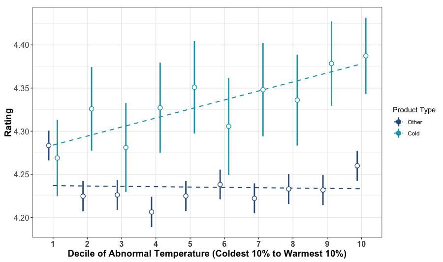

```{=html}
<style>
  p {
    margin-top: 1.25em;
  }
  h4 {
    margin-top: 2em;
  }
</style>
```

::: {style="text-align: left; margin-top: 3em;"}
This is the third in a series about star ratings/online reviews. I plan to mainly talk about my own research. 
:::

In two previous blogs ([1](star_ratings_steves.qmd), [2](star_ratings_kilos.qmd)), I argued that star ratings (or online reviews, customer ratings, etc.) are an exceptionally bad way to compare our options as consumers. The simplest reason I gave was that star ratings are not kilograms. Unlike kilograms, there is no standard or objective benchmark against which we can compare ratings. We plainly do not know what a star *is*.

But of course stars are not kilograms! What a stupid thing to write.^[Even in a blog.] Of course we cannot compare ratings to something objective. What would that even mean? Surely, a star rating is a measure of enjoyment. And if more people enjoy something, it should receive higher ratings, and *I should like it too*!^[This is largely the argument Itamar Simonson made in his book "Absolute Value" (https://www.amazon.com/Absolute-Value-Influences-Customers-Information/dp/B00XWCYXW4), and in a Journal of Consumer Research commentary (https://doi.org/10.1093/jcr/ucv091) in 2016.]

I see this argument as the "promise" of star ratings. In theory, a star might be equivalent to a **util**---a unit of utility or, for those who did not take or do not remember Econ 101, an objective measure of enjoyment. 

The previous two posts make a plain argument that star ratings are not clearly a measure of enjoyment; instead, they reflect [prior expectations](star_ratings_steves.qmd) and other things that influence [what a person considers to be good or bad](star_ratings_kilos.qmd) when they rate something. This makes it more difficult to argue that a past consumer's rating will be a good predictor of my own enjoyment, because their ratings are not all about enjoyment. 

This post takes a slightly different tact. Even when ratings *are* about enjoyment, another person's enjoyment might still be a poor predictor of my own---for reasons I cannot see in their reviews. This is because our experiences are shaped by many different things; us, the product or service, and the environment around us---including all that "the environment" entails. Therefore, how much we enjoy an experience---and how we rate it online---is also dependent on *all* those same factors. 

The main consequence of this is that ratings are much more random than we might hope. Someone does not *just* rate something five stars because it is awesome, and four because it is okay---they might rate a winter jacket four stars because it was bitterly cold outside, for example.

#### Enjoyment is a bad predictor of enjoyment

This blog post accompanies a recent paper that Nick Reinholtz and I published in the Journal of Marketing, titled "[Quality in Context: Evidence for the Arbitrary Influence of Situational Factors on User-Generated Product Ratings](https://doi.org/10.1177/00222429251365883). The example from that paper is clear enough that I re-use it here.

Nick and I both own more winter jackets than we (or our spouses) think we need to.^[Nick moreso than me, if you are counting.] For any one of my jackets, I care primarily about how warm it keeps me, how it looks, and how convenient it makes life. Therefore, my experience of owning it is shaped by the jacket’s style, build quality, technical features like extra pockets, type and amount of insulation, and more. 

However, other things that have nothing to do with the jacket itself affect my experience of owning it. For example, the weather: temperature, wind, rain, sun. This second list of factors are properties of the context in which I wear this jacket. If the point is to keep me warm, and being cold will make me unhappy, I will reasonably be less happy on a 30º^[Unfortunately, I will write temperatures in Fahrenheit in this post.] day than a 50º day. 

Ideally, this would not influence my eventual rating. The weather I wear something in has nothing to do with the jacket itself, so I should remove the influence of weather from my ratings, right? But *how* can I do this---how can I know exactly what influence my context (in this case, weather) had on my rating? If this seems incredibly complex, that is because it is.

To test whether context influences ratings, Nick and I scraped over 200,000 ratings from REI.com for cold-weather gear (things designed to keep people warm) and other products, and merged these ratings with local weather data from the day of the review and two before. This is a noisy measure of context, as we cannot see exactly when and where something was used. But, any problems should affect all products equally---and we are not interested in whether context affects ratings for all products equally.

Instead, we are interested in whether there is a distinct effect of recent temperature on products designed to keep users warm. This is because, by definition, temperature is directly relevant to the experience of wearing a winter jacket in ways it is not relevant to, say, a bicycle helmet. Therefore, if there is a different impact of temperature on these products designed to keep people warm, it stands to reason that this is because temperature has a unique effect on the enjoyment of these products, which leaks into people's ratings.

The figure below shows the relationship between temperature (on the x-axis) and ratings (on the y-axis) for cold-weather products^[Specifically, these products were listed in at least one of ten categories: gloves and mittens, snowboard clothing, ski clothing, men’s and women’s jackets, men’s and women’s snow jackets, and men’s and women’s insulated jackets.] (light blue) and all other products sold on REI.com (dark blue). Because "cold" and "warm" are inherently relative to location and season (40º Fahrenheit is extremely cold in San Francisco in September, but not so in Boulder in February), this figure does not plot raw temperatures, but temperatures *minus* normal temperature in the same location on the same day in other years.^[Specifically, we subtract the average three-day daily mean temperature from the years 2015-2023, other than the year of the review.] For simplicity, I have aggregated these observations into deciles for each product type---the points furthest left represent the average ratings in the coldest 10% of days, furthest right represent the average ratings in the warmest 10% of days, and so on. 

::: image-box
<p><strong>Relationship between ratings and temperature on REI.com</strong></p>


<p class="caption-note"><em>Lines extending from each point show the 95% confidence interval around each estimate. Dotted lines represent the linear trend across points in a category.</em></p>
:::

As is hopefully evident, ratings for products designed to keep people warm increase with temperature---warmer days lead to higher ratings. This is unique to cold-weather products, as the darker blue points have a largely flat relationship with temperature.^[The obvious exception to this is the coldest 10% of days for other products, where ratings are higher than any other decile. I do not have a reason for this to be the case, but I am all ears.]

We also find the same result in rain jackets---people give lower ratings to rain jackets if it has rained more in recent days. And, if you are skeptical and concerned that Nick and I have stumbled upon a spurious correlation, the published paper includes a [specification curve analysis](https://doi.org/10.1038/s41562-020-0912-z), where we test out 20,736 different models, finding the same result. As best as these data will tell us, it appears that people are allowing their context to affect their ratings.

#### But surely the reviewers mention this?

Whenever I present this paper---up to this point---someone inevitably comments something along the lines of "Even if ratings are influenced by context, people surely explain this influence in their written reviews, right?" If this were the case, the problem I have written about here would be relatively limited---for example, if a negative review is accompanied by "I did not like this jacket, but it was -30º when I wore it," you might reasonably conclude that the jacket would be fine for you, since you do not encounter such temperatures.

It turns out that a fair portion of people actually do mention the weather in which they use a product. Using GPT-4o-mini (which is uniquely great at pulling specific context out of complicated text), 42% of reviews for cold weather products and 60% of reviews for rain jackets mentioned context (temperature and precipitation, respectively). Unfortunately, the good news ends here, for two reasons. First, this "mention" of context is rarely specific enough to be useful; only 10% of reviews for cold-weather gear mention the weather with objective language---the rest use subjective words like "cold" and "warm," which are individual-specific. 

More damningly, reviews that mention weather actually show a much smaller effect of temperature on ratings than the ones that did not. In fact, there is not a significant relationship of temperature on ratings for reviews that do mention temperature. The main result is driven by those that do not mention temperature. This leaves consumers with no way to know what effect temperature had on these ratings---short of merging NCEI weather observations with each review, which I do not recommend from experience.

#### So what?

There are more consequences of this result than I will go into in this post,^[More are available in the paper itself.] but all fall under the umbrella of "there is a ton of noise in individual ratings." This means that average ratings are often not calculated from large enough samples. For example, Nick and I find that sorting products by ratings is effectively random; there is a very low correlation between products sorted by actual ratings and by ratings re-calculated to remove the effect of weather---and we only observe a single form of context in this paper, meaning there is almost certainly a lot we do not remove when re-sorting.

A second important consequence is that considering individual ratings or reviews is almost certainly a bad idea. These ratings do not contain enough information to explain *themselves*, let alone an entire product.

In combination, these consequences are not awesome. They mean that we cannot trust individual ratings, but also that we almost certainly do not have enough ratings for the majority of products to trust a summary of ratings. As a result, the biases I have written about in the past three posts are purely detrimental for people shopping online. Platforms like REI do not provide enough information for people to realize all of the influences on ratings, nor do these platforms use this information to help consumers. 

But, luckily, at least this blog post comes with a potential solution. In fact, one of the things I find most promising about this research is that someone smarter than I can figure out how to use context information (like weather) to improve recommendation systems without needing to ask reviewers themselves to provide more information. As I hope this post has shown, there is a ton of information contained *around* a rating that can be used to help consumers. If I can do this from my office and apartment, a data science team should not have a problem.^[Or, shamelessly, send me an email: mmeister@usfca.edu].

In the paper, Nick and I also show some ways that platforms can collect better ratings. In two experiments we show that it is possible to attenuate the effect of context on ratings by explicitly explaining to consumers (i) how their context was unique, and (ii) what impact this had on their experience with a product. The catch is that this **needs** to be quite heavy-handed. It is not enough to simply ask people to think about context---they do not anticipate its effect on their ratings. As a result of this heavy-handedness, these attenuation strategies are also product-specific, meaning that there is not one catch-all for every product that is reviewed on a site. However, it is possible.

As with the prior two posts, my recommendation for people shopping online is to help yourself by considering ratings or reviews very cautiously. Be aware of what they cannot tell you, and what information you are missing about how someone came to their evaluation. And learn about technical aspects of products! In the context of a winter jacket, do some reading about filling, build quality, etc. **That** information has certainly never been easier to acquire.

In future posts, I plan to talk about some of my other research on decision-making around personal finances and advice-taking. However, at some point I will also get back to the idea of sample sizes in online reviews, touched on here.